<div align="center">

# 👋 Hi, I'm Berwin CR

### B.Tech IT @ CEG • Software Developer • AI/ML Enthusiast


<br>

<a href="https://github.com/berwincr">

</a>

<a href="https://www.linkedin.com/in/berwin-cr-ceg/">

</a>

<a href="mailto:berwincr4028@gmail.com">

</a>

<br><br>


</div>

---

## 👨‍💻 About Me

🎓 B.Tech Information Technology student at **College of Engineering Guindy (CEG), Anna University**

💻 Interested in **Full-Stack Development and Software Engineering**

🤖 Exploring **Artificial Intelligence, Machine Learning and Data Science**

🧠 Building projects while strengthening my programming and problem-solving skills

🚀 I enjoy turning ideas into practical applications and learning through building.

---

# ⚡ Tech Stack

### 💻 Languages

<p>

</p>

### 🌐 Frontend

<p>

</p>

### ⚙️ Backend

<p>

</p>

### 🗄️ Databases

<p>

</p>

### ☁️ Cloud & Tools

<p>

</p>

### 🤖 AI / Data

`NumPy` • `Pandas` • `Scikit-learn` • `Matplotlib`

---

# 🚀 Featured Projects

## 🏥 MediGuide AI

> AI-powered healthcare education platform designed to make
> medicine-related information easier to understand.

### ✨ Highlights

- 📷 Medicine strip & prescription OCR
- 🤖 AI-generated medicine explanations
- 🌐 English & Tamil support
- 🔊 Voice interaction
- ⏰ Medication reminders
- 💊 Drug interaction awareness
- 🩺 Symptom-based educational guidance

### 🛠️ Tech Stack

`React` `Node.js` `Express.js` `MongoDB Atlas`

`Gemini API` `Tesseract OCR` `JWT`

---

## 💰 Ledger — Personal Finance Manager

> Full-stack personal finance management application for tracking
> income, expenses and spending patterns.

### ✨ Highlights

- 🔐 User registration & JWT authentication
- 💵 Income & expense tracking
- 🏷️ Transaction categorization
- 🔍 Search & advanced filtering
- 📊 Interactive financial reports
- 📈 Income vs Expense analytics
- 🥧 Category-wise spending charts
- 📱 Responsive dashboard
- 📄 Pagination & transaction management

### 🛠️ Tech Stack

**Frontend**

`React` `Vite` `Tailwind CSS` `Axios` `React Router` `Chart.js`

**Backend**

`Node.js` `Express.js` `MongoDB Atlas` `Mongoose`

`JWT` `bcrypt` `Express Validator`

**Deployment**

`Vercel` • `Render` • `MongoDB Atlas`

---

# 📂 Other Projects

### 🌱 Vidhai — Seed Bank Management System

Full-stack Seed Bank Management System developed as a DBMS project.

**Features**

- 🌾 Seed inventory management
- 🛒 Seed ordering
- 🔍 Search & filtering
- 🌱 Add seeds
- 🗄️ Relational database

**Tech:** `React` `Flask` `MySQL`

---

### 🎓 Campus Event Management System

A web application where department-specific events can be hosted
and students can register for them.

**Focus:** Event hosting • Student registration • Department-specific events

---

### 🐍 Python Learning Repository

A collection of Python programs and implementations created while
learning and practicing Python concepts.

**Focus:** `Python` • Programming Fundamentals • Practice

---

### 🧠 LeetCode Solutions

A collection of my solutions to programming problems solved on
LeetCode.

**Focus:** `C++` • Data Structures • Algorithms • Problem Solving

---

### 🌐 Personal Portfolio

A personal portfolio website containing information about me,
my skills and my projects.

---

# 🧠 Problem Solving

I use coding problems and projects to continuously improve my
problem-solving and programming skills.

### Platforms & Practice

<p>
<a href="https://leetcode.com/u/Berwin_cr/">

</a>

<a href="https://github.com/berwincr">

</a>
</p>

---

# 📊 GitHub Activity

<div align="center">





</div>

---

## 📈 Contribution Activity

<div align="center">


</div>
---

# 🎯 What I'm Working Towards

```text
💻 Strong Software Engineering fundamentals

🌐 Building better full-stack applications

🤖 Exploring Artificial Intelligence & Machine Learning

🧠 Improving Data Structures & Problem Solving

🚀 Turning ideas into useful products
```
---
# 🌐 Connect With Me
<div align="center"> <a href="https://github.com/berwincr">  </a> <a href="https://www.linkedin.com/in/berwin-cr-ceg/">  </a> <a href="mailto:berwincr4028@gmail.com">  </a> </div> <br> <div align="center">
  ---
  
# 🚀 Build something worth remembering.
 </div> ```
